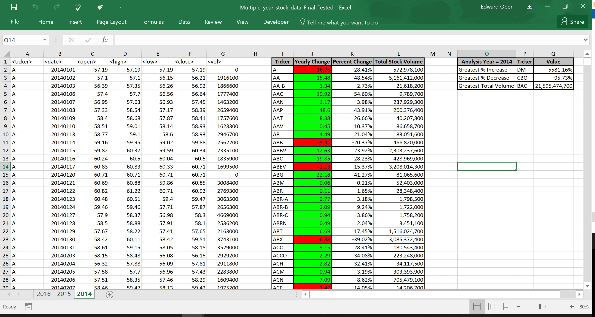
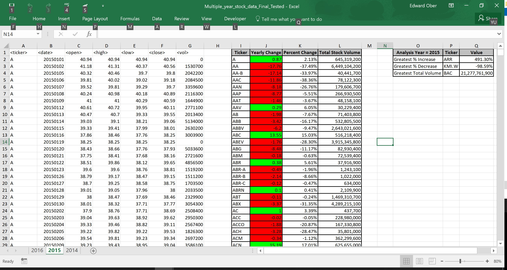

# VBA Homework Submission - The VBA of Wall Street

## Overview

This is the VBA of Wall Street Homework Submission.

Included in this repository are: 
* VBA Files that solve the homeworks assignments
* Screen Shots of the yearly tabs showing the solutions
* An 'Other' file with a A backup copy of all of the screenshots in a word document

### Files

* [VBA Code](Code) - 2 files with the solutions to the assignment:

  * [Primary Assignment](Code/VBA_Challenge_-_Wall_Street_Primary_Assignment.bas)- Scans the worksheets and creates the summary file by ticker

  * [Bonus Assignment](Code/VBA_Challenge_-_Wall_Street_Bonus_Assignment.bas) - Scans the above summary file and creates the worksheets and creates the summary file by ticker

* [Screen Shots](Images) - Screen Shots of each yearly worksheets showing the final results.

* [Other](Other/VBA_Wall_Street_Screenshots.docx) - Contains a backup copy of all the yearly screen shots in a word document.

  
### Stock market analysis - Screen Shots for each Year

* 2014

* 2015

* 2016
